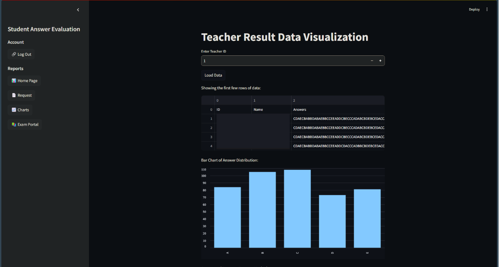

### Student Answer Evaluation System

<!-- TABLE OF CONTENTS -->
<details>
  <summary>Table of Contents</summary>
  <ol>
    <li>
      <a href="#about-the-project">About The Project</a>
      <ul>
        <li><a href="#built-with">Built With</a></li>
      </ul>
    </li>
    <li>
      <a href="#getting-started">Getting Started</a>
      <ul>
        <li><a href="#prerequisites">Prerequisites</a></li>
        <li><a href="#installation">Installation</a></li>
      </ul>
    </li>
    <li><a href="#usage">Usage</a></li>
    <li><a href="#roadmap">Roadmap</a></li>
    <li><a href="#contributing">Contributing</a></li>
    <li><a href="#license">License</a></li>
    <li><a href="#contact">Contact</a></li>
    <li><a href="#acknowledgments">Acknowledgments</a></li>
  </ol>
</details>

<!-- ABOUT THE PROJECT -->

## About The Project


This project is a web-based application built using Streamlit and MySQL, designed to assist teachers in reviewing and modifying student exam answers. The system allows faculty to assign exam answer files to teachers, who can then evaluate the students' performance through various functionalities such as question cancellation, answer modification, and detailed error analysis.

## Key Features:

- Teacher Authentication: Secure login system with username and password.
- Session Management: User session persists until manually logged out.
- Answer Sheet Modification: Teachers can:
- View their assigned answer sheets.
- Modify the answer sheets (e.g., cancel questions, correct errors).
- Analyze student mistakes directly within a DataFrame.
- Request further modifications from the admin.
- Answer Distribution Analysis:
- View the distribution of answers given by students.
- Understand where students struggled based on distribution insights.

The platform leverages Streamlit for its user interface, MySQL for data management, and supports uploading and processing `.dat` files. The calculated results are stored in the system, and teachers can download them as `.xls` files.


<!-- GETTING STARTED -->

## Getting Started

This is an example of how you may give instructions on setting up your project locally.
To get a local copy up and running follow these simple example steps.

### Installation

_Below is an example of how you can instruct your audience on installing and setting up your app. This template doesn't rely on any external dependencies or services._

1. Clone the repository:
   ```sh
   git clone https://github.com/yourusername/teacher-dashboard-system.git
   ```
2. Install the required Python packages:

   ```sh
   pip install -r requirements.txt
   ```

   Update Mysql Connection`

   ```js
   def get_connection():
    return mysql.connector.connect(
        host="your-localhost",
        user="your-root",
        password="your-password",
        database="your-database"
    )

   ```

3. Run the Streamlit app:
   ```sh
   streamlit run app.py
   ```

<!-- USAGE EXAMPLES -->

Technologies Used
Streamlit: For creating the interactive web application.
MySQL: Backend database to store teacher information and answer sheet data.
Pandas: Used for DataFrame-based analysis and insights into student performance.
Python: Backend logic and database interaction.
CSS: Custom styles for improving user interface aesthetics.

## Pages

1. Login Page


2. Teacher Dashboard


3. Answer Analysis



<!-- ROADMAP -->

## Roadmap

- [x] Advanced Visualization
- [x] Role Management
- [ ] Add notification system
- [ ] Add version control for answer sheets.
- [ ] Multi-language Support
  - [ ] German
  - [ ] Spanish

<!-- LICENSE -->

## License

Distributed under the MIT License. See `LICENSE.txt` for more information.


<!-- CONTACT -->

## Contact

Muhammed Kartal - [muhammed@kartal.dev](muhammed@kartal.dev) - [Kartal.dev]

Project Link: [https://github.com/muhkartal/utab-uni](https://github.com/muhkartal/utab-uni)
